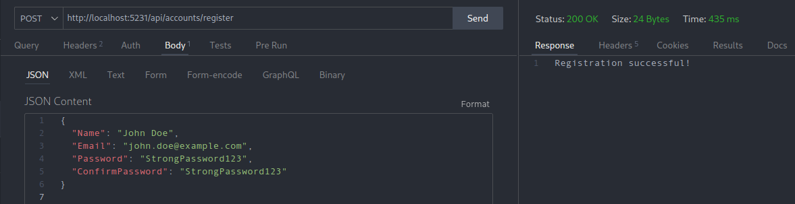
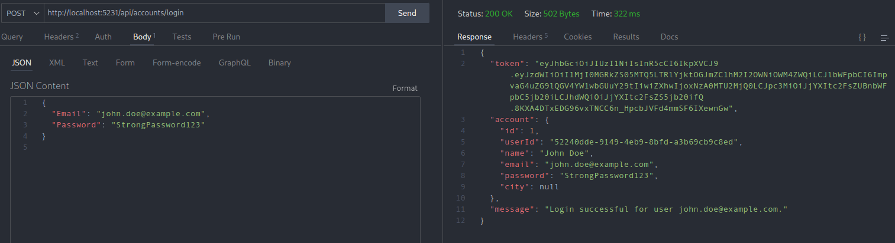

# Проект "Car-sales" в виде набора микросервисов: ...

<u>Описание</u>: Приложение на C# (ASP.NET), которое предоставляет отображение машин разный моделей, категорий и различные операции над ними от лица клиента и продавца.

<u>Стек</u>: Net 7, ASP.NET 7, PostgreSQL, Docker, ...

## Микросервис "Account-service"

### Регистрация

### Авторизация

## Микросервис "Car-service"

123

## Микросервис "Favorite-service"

123

## Микросервис "Api-gateway-service"

123
